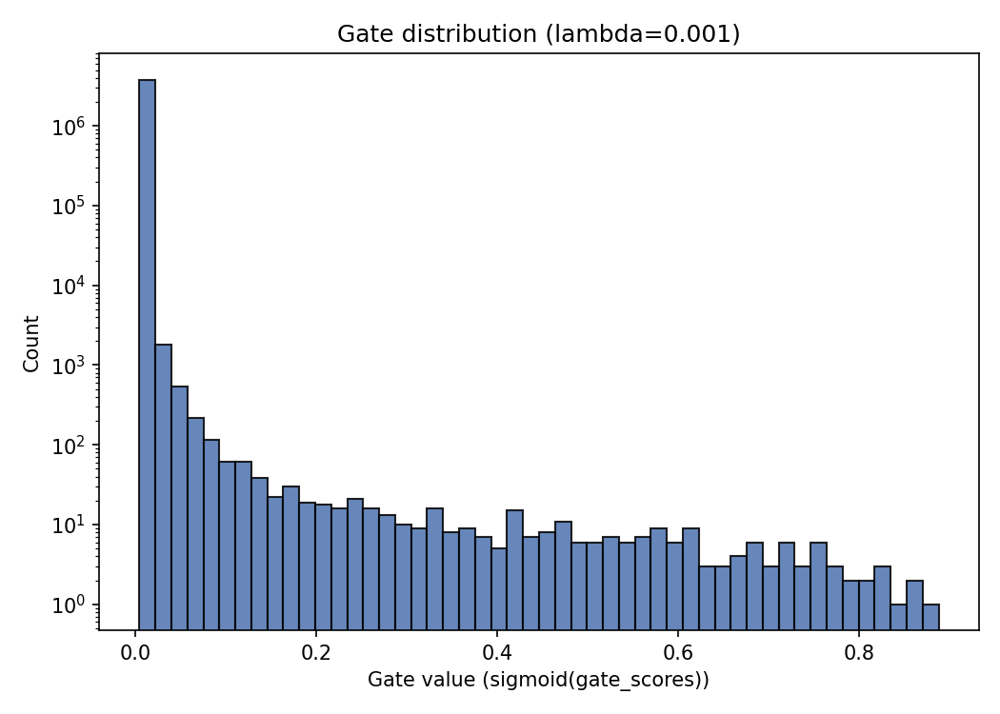

# The Self-Pruning Neural Network — Report

## 1. Why an L1 penalty on the sigmoid gates encourages sparsity

Each weight has a gate `g = sigmoid(gate_score) ∈ (0, 1)`, and the total loss is:

```
Total Loss = CrossEntropy(logits, y) + λ * Σ g
```

The classification loss only cares about the *product* `weight * gate`; it has
no preference for what `gate` is individually, as long as the product gives
good predictions. The L1 term `Σ g`, on the other hand, has a constant
gradient of `+λ` with respect to each gate, pushing every gate toward 0
regardless of its current value (unlike an L2 penalty, whose gradient shrinks
as the value approaches 0 and effectively stalls near the origin). So for any
connection the classification loss doesn't actively need, gradient descent
keeps paying the constant `λ` cost until the gate is driven low enough that
`sigmoid` saturates toward 0. Because `sigmoid` saturates rather than just
approaching 0 asymptotically in a soft way, gates that lose the tug-of-war end
up parked very close to exactly 0, while gates the classification loss
actively fights to keep open settle at values well away from 0. That's what
produces the bimodal "spike at 0 + cluster away from 0" distribution the case
study asks for. `λ` sets the strength of that constant pull: higher `λ`
prunes more connections (and eventually starts cutting into accuracy as it
prunes connections the network still needed).

## 2. Results

| Lambda | Test Accuracy | Sparsity Level (%) |
|---|---|---|
| 0.0005 | 52.09% | 98.52% |
| 0.001 | 49.54% | 99.64% |
| 0.01 | 37.74% | 99.98% |
| 0.1 | 21.61% | 100.00% |

### Discussion of the trade-off

At lambda=0.0005 (test accuracy 52.09%, sparsity 98.52%), the sparsity penalty is weak enough that the network keeps nearly all connections open, close to its un-pruned accuracy. At lambda=0.01 (test accuracy 37.74%, sparsity 99.98%), sparsity increases substantially (a +14.35-point change in accuracy vs. the lowest lambda), suggesting a meaningful fraction of connections were redundant and could be removed at little cost. At lambda=0.1 (test accuracy 21.61%, sparsity 100.00%), the penalty is strong enough to start cutting into connections the network actually needs, and accuracy drops further (+30.48 points vs. the lowest lambda). Overall this traces out the expected sparsity-vs-accuracy trade-off: sparsity rises monotonically with lambda, and accuracy holds up until the penalty gets strong enough to prune connections the network was actually using. The best balance in this sweep was lambda=0.001 (test accuracy 49.54%, sparsity 99.64%).

## 3. Gate value distribution (best model: lambda=0.001)


